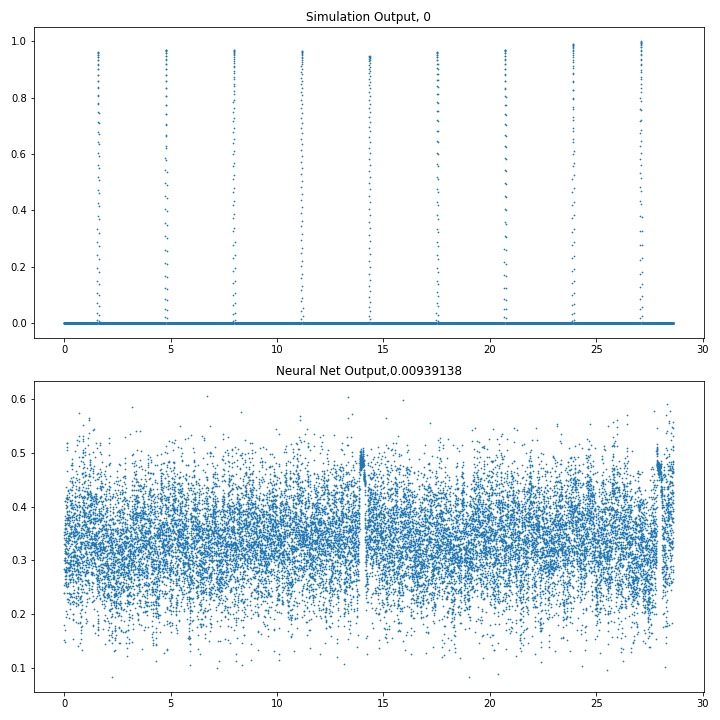

<p align="center"></p>
<a href="https://zenodo.org/badge/latestdoi/224247579"></a>


## Overview

The code to reproduce the results of:

Shallow Transits --- Deep Learning II: Identify Individual Exoplanetary Transits in Red Noise using Deep Learning.

## Visualize the Learning Process


<br>


## Dependencies
Tensorflow 1.1.0

Keras 2.0.8

tqdm

astropy

batman-package

## Running the Code
To run the code, first run the preprocessing notebook: Strudel_Astropy_Preprocess.ipynb

Then, use the network training notebook: Strudel_Astropy_GAN_training.ipynb

For results of a pure transits classifier run: Strudel_Astropy_Only_Classifier.ipynb 

#### Output
Strudel_Astropy_Preprocess: 

total_*_sim.npy - Files containing data about all lightcurves both with and without transits.

total_*_sim_train.npy / total_*_sim_test.npy - Files containing a small subset (20000 / 10000) of the above data for training/testing the model.

total_*_sim_true.npy - Files containing only lightcurves with tranits from the full data above.

total_*_sim_train_true.npy / total_*_sim_test_true.npy - Files containing a small subset (20000 / 10000) of the above transit only data for training/testing the model.


Strudel_Astropy_GAN_training:

transit_parameters.npy / transit_parameters.csv - predicted transit parameters by the GAN and processing pipeline.

real_classification.npy / real_classification.csv - ground truth values for transit data.

predicted_classification.npy / predicted_classification.csv - predictions for transit data.

predicted_transits.npy - predicted segmentations for the transits.

real_transits.npy - real binary segmentations for the transits.

real_data.npy - real full data for the predicted lightcurves.

ROC_AUC_FULL.csv - ROC curve points for the classifier.

transit_parameters.npy / transit_parameters.csv - transit parameter estimations for all lightcurves.

img_*_test.png - images of a single lightcurve segmentation results through the training process.

img_ClassAUC_*_test.png - images of the ROC curve of the classifier through the training process.

img_PAUC_*_test.png - images of the period detection success curves through the training process.


Strudel_Astropy_Only_Classifier:

ROC_AUC_FULL_only_classfier.csv - ROC curve points for the classifier.
#### Bibtex
```
@misc{https://doi.org/10.48550/arxiv.2203.08017,
  doi = {10.48550/ARXIV.2203.08017},
  
  url = {https://arxiv.org/abs/2203.08017},
  
  author = {Dvash, Elad and Peleg, Yam and Zucker, Shay and Giryes, Raja},
  
  keywords = {Instrumentation and Methods for Astrophysics (astro-ph.IM), FOS: Physical sciences, FOS: Physical sciences},
  
  title = {Shallow Transits -- Deep Learning II: Identify Individual Exoplanetary Transits in Red Noise using Deep Learning},
  
  publisher = {arXiv},
  
  year = {2022},
  
  copyright = {Creative Commons Attribution 4.0 International}
}
```
